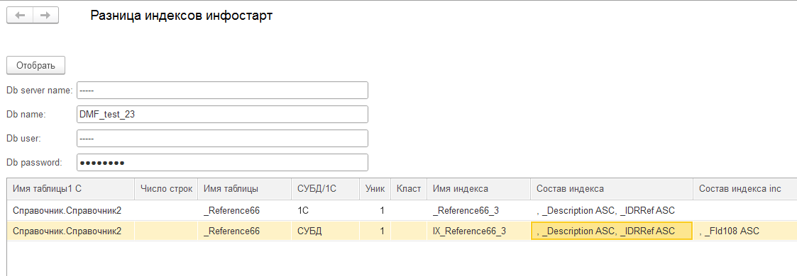

# Опыт использования оптимизированного механизма реструктуризации (v2) на базе размером 36 терабайт (дополнительные материалы).
## Содержание
1. [Обработка для получения разницы индексов по данным 1С и СУБД](#epf)
2. [Файл настроек технологического журнала для логирования запросов при реструктуризации v2](#logcfg)
1. [Ошибки при реструктуризации v2 (номер ошибки, номера релизов с исправлением)](#issues)
1. [Ветка на партнерском форуме 1С про неоптимальное удаление реквизита документа для PostgreSQL](#issue_delete)

## Обработка для получения разницы индексов по данным 1С и СУБД <a name="epf"></a>
Обработка работает на сервере 1С под Windows используя COM-объект ADODB.

Обработка проверяет, что база в которой запущена обработка и база подключенная через ADODB одна и та же.

По умолчанию обработка подключается в попытке к MS-SQL, а при ошибке подключается к PostgreSQL.

В примере на скриншоте удален типовой индекс, а вместо типового добавлен вручную индекс с полем include.



## Файл настроек технологического журнала для логирования запросов при реструктуризации v2 <a name="logcfg"></a>


Пример строк логов с запросом
```
34:34.008000-0,SYSTEM,0,level=DEBUG,component=dmf,class=com._1c.dmf.internal.sqlframework.SqlConnection,line=,file=,threadId=1,message='Query started. Text query: UPDATE __alias1 WITH(TABLOCK) SET _Fld73_TYPE_NO = CASE WHEN ((__alias1._Fld73_TYPE = 0x08) AND (__alias1._Fld73_RTRef = 0x00000047)) THEN 0x01 ELSE __alias1._Fld73_TYPE END, _Fld73_RRRef_NO = CASE WHEN ((__alias1._Fld73_TYPE = 0x08) AND (__alias1._Fld73_RTRef = 0x00000047)) THEN 0x00000000000000000000000000000000 ELSE __alias1._Fld73_RRRef END, _Fld73_RTRef_NO = CASE WHEN ((__alias1._Fld73_TYPE = 0x08) AND (__alias1._Fld73_RTRef = 0x00000047)) THEN 0x00000000 ELSE __alias1._Fld73_RTRef END FROM _InfoRg72 AS __alias1'
34:34.015000-0,SYSTEM,0,level=DEBUG,component=dmf,class=com._1c.dmf.internal.sqlframework.SqlConnection,line=,file=,threadId=1,message='Query was completed in 7 millis. Text query: UPDATE __alias1 WITH(TABLOCK) SET _Fld73_TYPE_NO = CASE WHEN ((__alias1._Fld73_TYPE = 0x08) AND (__alias1._Fld73_RTRef = 0x00000047)) THEN 0x01 ELSE __alias1._Fld73_TYPE END, _Fld73_RRRef_NO = CASE WHEN ((__alias1._Fld73_TYPE = 0x08) AND (__alias1._Fld73_RTRef = 0x00000047)) THEN 0x00000000000000000000000000000000 ELSE __alias1._Fld73_RRRef END, _Fld73_RTRef_NO = CASE WHEN ((__alias1._Fld73_TYPE = 0x08) AND (__alias1._Fld73_RTRef = 0x00000047)) THEN 0x00000000 ELSE __alias1._Fld73_RTRef END FROM _InfoRg72 AS __alias1'
```
## Ошибки при реструктуризации v2 (номер ошибки, номера релизов с исправлением) <a name="issues"></a>
### 60003139 Ошибка: Exception in thread "main" com._1c.dmf.comparator.ComparatorException: Конвертер com._1c.dmf.v8.converters.attributes.typedfield.TypedFieldConverter@6340e5f0 определил объект "Reference35.Fld38" как некорректный
После реструктуризации с использованием оптимизированного механизма, если в объекте конфигурации, например, справочнике, нет данных и изменился только тип ссылочного реквизита, при попытке записи нового элемента происходит ошибка:

"Ошибка SDBL:
Ссылочная константа содержит недопустимый ссылочный номер таблицы."

После этой ошибки становится некорректной схема базы данных и при следующий реструктуризации v2, выдается ошибка про некорректный объект.

Планируется исправить: "Технологическая платформа", версия 8.3.18

Исправлена: "Технологическая платформа", версия 8.3.19.1770

Исправлена: "Технологическая платформа", версия 8.3.20.2257

Исправлена: "Технологическая платформа", версия 8.3.21.1674

Исправлена: "Технологическая платформа", версия 8.3.22.1750

Исправлена: "Технологическая платформа", версия 8.3.23.1688

Исправлена: "Технологическая платформа", версия 8.3.24.1020 (для тестирования)

### 70024354 После обновления конфигурации главного узла распределенной информационной базы при помощи оптимизированного механизма реструктуризации в подчиненных узлах при получении сообщений обмена происходит ошибка Конфигурация узла распределенной ИБ не соответствует ожидаемой!
на 8.3.19 еще не проявляется

Исправлена: "Технологическая платформа", версия 8.3.22.2227 (для тестирования)

Исправлена: "Технологическая платформа", версия 8.3.24.1020 (для тестирования)

### 60009183 Ошибка СУБД: Microsoft OLE DB Driver for SQL Server: Недопустимое имя объекта "dbo._AccRg57NG".
Ошибка реструктуризации при удалении регистратора из движений, когда нет движений.

На 8.3.21 еще не проявляется, исправлено в 8.3.23.1782.

### 60007722 Действие: prepare Exception in thread "main" java.lang.IllegalArgumentException: selectList must not be empty
В конфигурации существует непериодический регистр сведений с измерением типа строка,
тип измерения изменен на ссылочный тип и при попытке реструктуризации возникает ошибка.

не исправлена

### 70050741 Ошибка: Exception in thread "main" com._1c.dmf.sqlframework.SqlExecutionException: При выполнении SQL-оператора возникла ошибка SQL reason: Adding a value to a 'datetime' column caused an overflow.
При **нулевом смещении даты в базе MS-SQL** когда у справочника меняется тип реквизита дата с ДатаВремя на Время, то при попытке реструктуризации возникает ошибка.

не исправлена

### <нет номера> Ошибка: Exception in thread "main" com._1c.dmf.sqlframework.SqlEvaluationException: При вычилении sqlOperator возникла ... Caused by: com._1c.dmf.common.evaluation.UnsupportedEvaluableException: Дата {0} не может быть сохранена в базе данных MS SQL Server с нулевым смещением дат
При **нулевом смещении даты в базе MS-SQL** когда у справочника есть реквизит типа дата, а также меняется тип строкового реквизита на число, но при конвертации пустой даты возникает ошибка.

Исправлена: "Технологическая платформа", версия 8.3.18.1894

Исправлена: "Технологическая платформа", версия 8.3.19.1659

Исправлена: "Технологическая платформа", версия 8.3.20.1996

Исправлена: "Технологическая платформа", версия 8.3.21.1484

Исправлена: "Технологическая платформа", версия 8.3.22.1603

## Ветка на партнерском форуме 1С про неоптимальное удаление реквизита документа для PostgreSQL <a name="issue_delete"></a>
"https://partners.v8.1c.ru/forum/topic/2053074#m_2053074"

Некоторые подробности отличий механизмов для MS-SQL и PostgreSQL.

Если для вас актуальна проблема длительного удаления реквизитов на PostgreSQL, тогда голосуйте.
